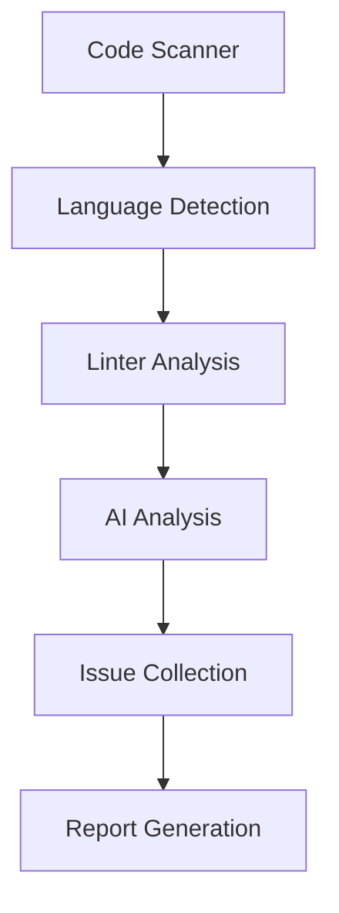
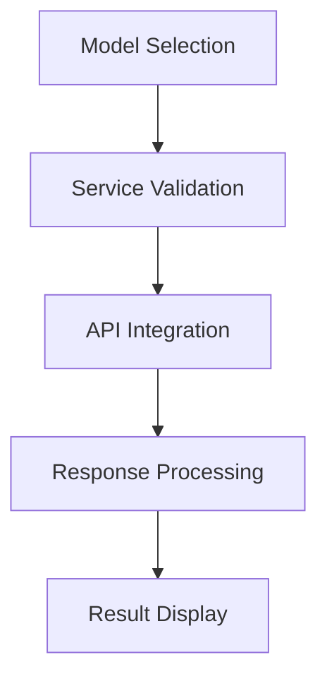
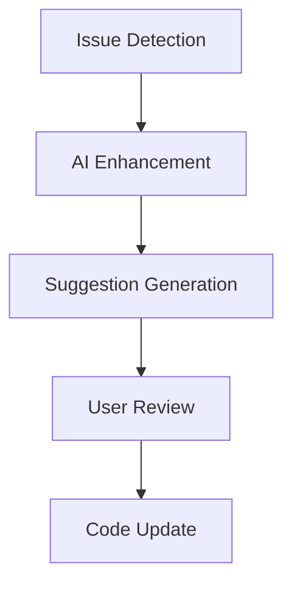

# AI Coder Assistant UI Inventory

## Main Window Components

### 1. AI Agent Tab
- Model Source Selector (Ollama/Own Model)
- Scan Directory Selection
- Include/Exclude Patterns
- Start/Stop Scan Buttons
- Progress Indicators
- Log Messages Area

### 2. LLM Studio Tab
- Model Management
- Training Controls
- Model Performance Metrics
- Data Processing Status

### 3. Cloud Models Tab
- Provider Selection
- API Key Management
- Model Selection
- Cost Tracking
- Usage Statistics

### 4. Ollama Manager
- Model List
- Pull/Delete Controls
- Export Options
- Instance Management
- Health Status

### 5. Data Training Tab
- Dataset Management
- Training Configuration
- Progress Monitoring
- Model Evaluation

### 6. Continuous Learning
- Feedback Collection
- Model Improvement
- Performance Tracking
- Data Quality Metrics

### 7. Export to Ollama
- Model Export Settings
- Format Selection
- Progress Tracking
- Status Updates

### 8. Advanced Refactoring
- Code Analysis
- Refactoring Rules
- Preview Changes
- Apply Controls

### 9. Performance Optimization
- Code Profiling
- Bottleneck Detection
- Optimization Suggestions
- Metrics Display

### 10. Code Standards
- Standard Selection
- Rule Configuration
- Violation Reports
- Auto-fix Controls

### 11. PR Management
- PR Creation
- Template Selection
- Review Status
- Integration Settings

### 12. Security Intelligence
- Vulnerability Scanning
- Security Reports
- Patch Management
- CVE Monitoring

### 13. Web Server
- Server Controls
- API Documentation
- Request Monitoring
- Performance Stats

## Dialogs and Popups

### 1. Suggestion Dialog
- Issue Description
- Original Code
- Suggested Fix
- AI Explanation
- Action Buttons (Apply/Skip/Cancel)

### 2. Report Viewer
- Report Content
- Export Options (MD/HTML/TXT/PDF)
- Search Functionality
- Navigation Controls

### 3. Settings Dialog
- General Settings
- Model Configuration
- Integration Settings
- UI Preferences

### 4. Progress Dialogs
- Operation Progress
- Cancel Option
- Status Messages
- Time Estimates

## Data Flow

### 1. Code Analysis Flow

### 2. Model Integration Flow

### 3. Suggestion Flow

## Button Inventory

### AI Agent Tab
- Select Directory
- Start Scan
- Stop Scan
- Generate Report
- Review Suggestions
- Clear Results

### Model Management
- Refresh Models
- Pull Model
- Delete Model
- Export Model
- Create Model
- Update Model

### Report Generation
- Generate Report
- Export as Markdown
- Export as HTML
- Export as TXT
- Export as PDF
- Save Report

### PR Management
- Create PR
- Update PR
- Close PR
- Sync Status
- Apply Template

## Settings and Configuration

### General Settings
- Theme Selection
- Language Preferences
- Auto-save Options
- Update Preferences

### Model Settings
- Default Model
- API Configuration
- Cache Settings
- Performance Tuning

### Integration Settings
- Git Configuration
- JIRA Settings
- ServiceNow Setup
- CI/CD Integration

### Security Settings
- API Key Management
- Access Control
- Audit Logging
- Security Policies

## Keyboard Shortcuts

### Global Shortcuts
- Ctrl+S: Start Scan
- Ctrl+R: Generate Report
- Ctrl+P: Create PR
- Ctrl+F: Find in Results
- Esc: Cancel Operation

### Navigation Shortcuts
- Alt+1: AI Agent Tab
- Alt+2: LLM Studio
- Alt+3: Cloud Models
- Alt+4: Ollama Manager
- Alt+5: Data Training

### Action Shortcuts
- Ctrl+A: Apply Suggestion
- Ctrl+K: Skip Suggestion
- Ctrl+D: Delete Model
- Ctrl+E: Export Report
- Ctrl+M: Model Management 